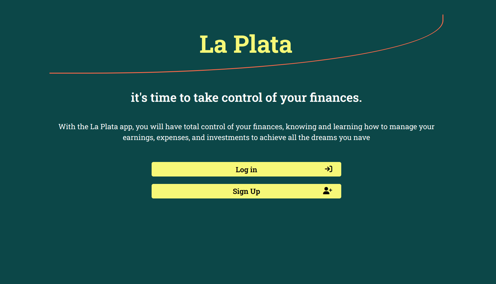
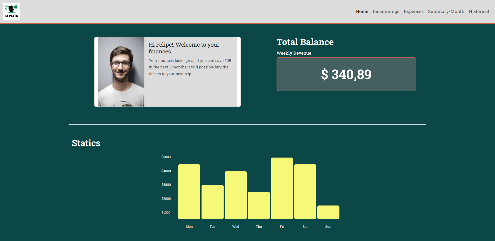

# **La Plata**
Web Project developed for my Web Analysis and Development course with FIAP University.
The project was based on design using Figma and the implementation of responsive design using the CSS framework Bootstrap.

## **Screenshot**

### Sign in

### Profile

## **Link Demo**
Puedes visitar el resultado en el link: 
	[La Plata](https://www.pipetoroc.github.io/la-plata-fintech)

## **Technologies**

- Semantic HTML5 markup
- CSS custom properties
- CSS Grid
- Flexbox
- Bootstrap
- Figma

## **License**
- MIT